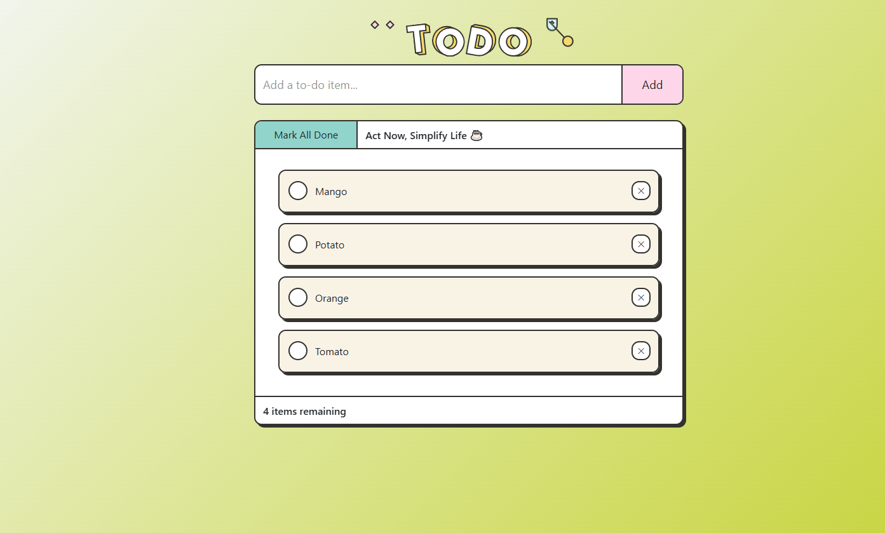
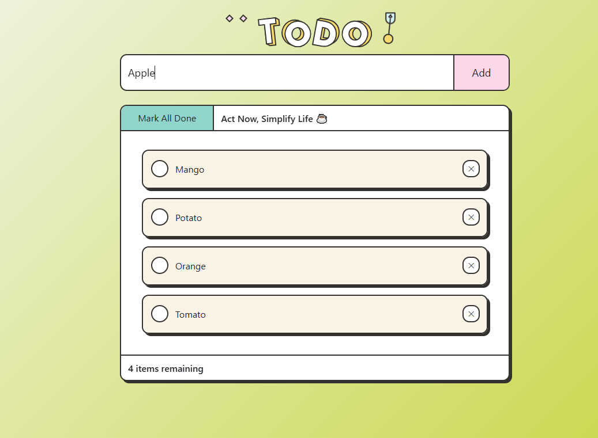
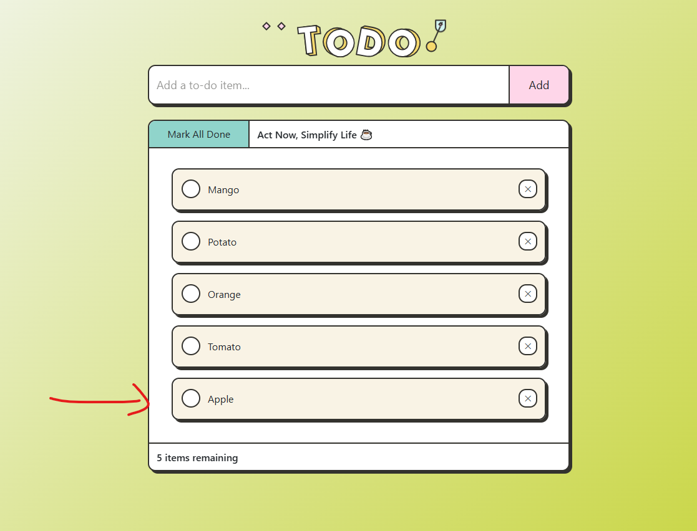
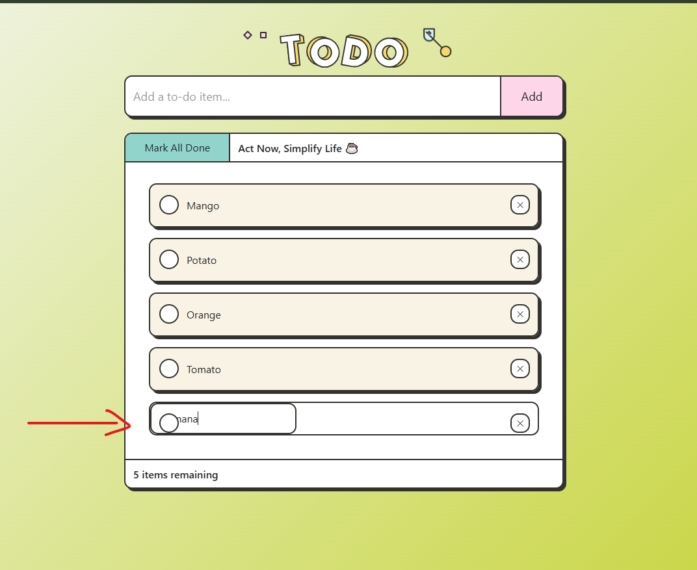
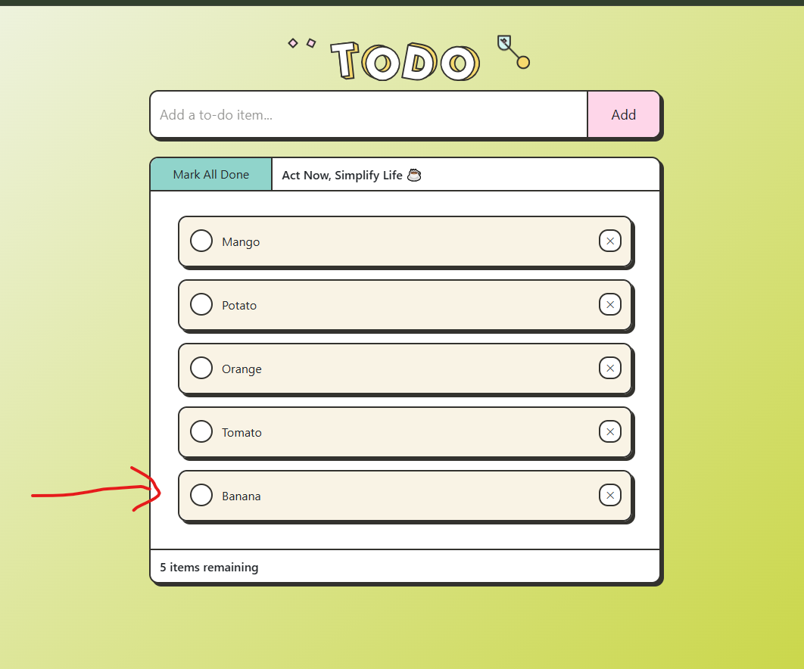
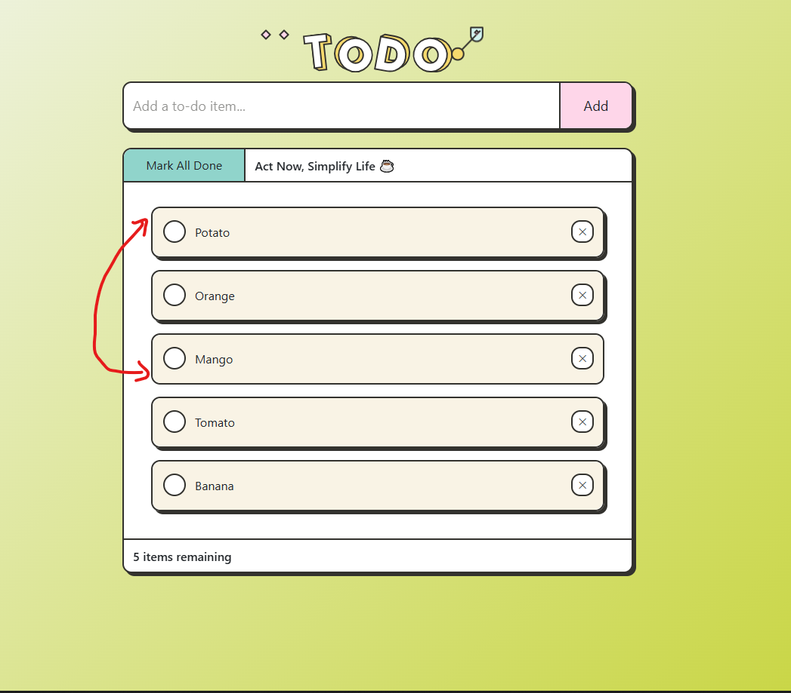

# 📝 React ToDo List App


A modern **ToDo List Application built with React** that helps users manage their daily tasks efficiently.
The application allows users to **add, edit, delete, complete, and reorder tasks using drag & drop** while storing data in **localStorage**, ensuring tasks remain saved even after refreshing the page.

---

# 🚀 Live Demo

🔗 https://to-do-list-znqr.vercel.app/

---

# 📸 Screenshots

### 🏠 Home Screen

<p align="center">

</p>

---

### ➕ Adding a Task

<p align="center">

</p>

---

### ✅ Completed Task

<p align="center">

</p>

---

### ✏️ Editing a Task

(Double click on a task to edit)

<p align="center">

</p>

---

### 🔄 Updated Task

<p align="center">

</p>

---

### 🔀 Drag & Drop Tasks

<p align="center">

</p>

---

# ✨ Features

✔ Add new tasks
✔ Edit tasks by **double clicking**
✔ Delete tasks
✔ Mark tasks as **completed / uncompleted**
✔ **Mark all tasks as completed**
✔ **Drag & Drop task reordering**
✔ Tasks stored in **localStorage**
✔ Remaining tasks counter

---

# 🛠 Tech Stack

* ⚛️ **React (Functional Components)**
* React Hooks

  * useState
  * useEffect
* JavaScript (ES6)
* HTML5
* CSS3
* LocalStorage API

---

# 📂 Project Structure

```
react-todo-list
│
├── public
│   └── img
│       └── todo.svg
│
├── src
│   ├── components
│   │   └── ToDoList.js
│   │
│   ├── App.js
│   └── index.js
│
├── screenshots
│   ├── home.png
│   ├── add-task.png
│   ├── completed-task.png
│   ├── edit-task.png
│   ├── updated-task.png
│   └── drag-drop.png
│
└── README.md
```

---

# ⚙️ Installation

### 1️⃣ Clone the Repository

```
git clone https://github.com/HassanZohaibJadooni/To-Do-List.git
```

---

### 2️⃣ Navigate to the Project Folder

```
cd react-todo-list
```

---

### 3️⃣ Install Dependencies

```
npm install
```

---

### 4️⃣ Run the Application

```
npm run dev
```

The application will start at:

```
http://localhost:3000
```

---

# 💡 Usage

1️⃣ Enter a task in the input field

2️⃣ Click **Add** or press **Enter**

3️⃣ Click **✓** to mark the task completed

4️⃣ **Double click** the task to edit it

5️⃣ Click **✕** to delete the task

6️⃣ **Drag & drop** tasks to reorder them

---

# 🧠 Learning Objectives

This project helps developers understand:

* React functional components
* React Hooks (useState, useEffect)
* State management
* Drag & drop interactions
* LocalStorage data persistence
* Building interactive UI with React

---

# 🔮 Future Improvements

* 🔍 Task search functionality

* 📅 Task due dates

* 📊 Task statistics dashboard

* 🎨 Dark mode UI

* ☁️ Cloud database integration

---

# 👨‍💻 Author

Developed by **Hassan Zohaib Jadoon**

GitHub:
https://github.com/HassanZohaibJadooni/

---

⭐ If you like this project, please **star the repository**.
